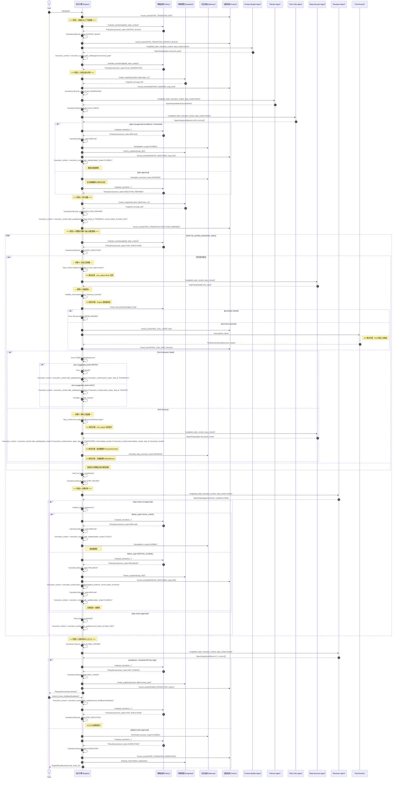

```mermaid


sequenceDiagram
    autonumber
    actor User
    participant Engine as "执行引擎 (Engine)"
    participant Policy as "策略治理 (Policy)"
    participant Snapshot as "快照管理 (Snapshot)"
    participant Memory as "记忆系统 (Memory)"
    participant Tracer as "追踪系统 (Tracer)"
    participant ContextBuilder as "Context Builder Agent"
    participant Planner as "Planner Agent"
    participant PlanCritic as "Plan Critic Agent"
    participant StepExecutor as "Step Executor Agent"
    participant Reviewer as "Reviewer Agent"
    participant Tool as "Tool Runtime"

    User->>Engine: "start(goal)"
    activate Engine
    Engine->>Tracer: "record_event(STATE_TRANSITION, INIT)"
    
    note over Engine: === 阶段 1: 初始化与上下文构建 ===
    Engine->>Policy: "evaluate_transition(global_state, context)"
    Policy-->>Engine: "PolicyDecision(next_state=CONTEXT_BUILD)"
    
    Engine->>Engine: "transition() lifecycle_state=CONTEXT_BUILD"
    Engine->>Tracer: "record_event(STATE_TRANSITION, CONTEXT_BUILD)"

    Engine->>ContextBuilder: "run(global_state, execution_context, step_context=None)"
    activate ContextBuilder
    ContextBuilder-->>Engine: "AgentOutput(data=structured_goal)"
    deactivate ContextBuilder
    
    Engine->>Engine: "execution_context = execution_context.safe_update(goal=structured_goal)"
    Engine->>Policy: "evaluate_transition(global_state, context)"
    Policy-->>Engine: "PolicyDecision(next_state=PLAN_GENERATION)"

    note over Engine: === 阶段 2: 计划生成与评审 ===
    Engine->>Snapshot: "create_snapshot(context, label=plan_v1)"
    Snapshot-->>Engine: "snapshot_id=snap_001"
    Engine->>Tracer: "record_event(SNAPSHOT_CREATED, snap_001)"

    Engine->>Engine: "transition() lifecycle_state=PLAN_GENERATION"
    Engine->>Planner: "run(global_state, execution_context, step_context=None)"
    activate Planner
    Planner-->>Engine: "AgentOutput(data=ExecutionPlan)"
    deactivate Planner
    
    Engine->>Engine: "transition() lifecycle_state=PLAN_CHECK"
    Engine->>PlanCritic: "run(global_state, execution_context, step_context=None)"
    activate PlanCritic
    PlanCritic-->>Engine: "AgentOutput(confidence=0.95, errors=[])"
    deactivate PlanCritic

    alt plan not approved (confidence < threshold)
        Engine->>Policy: "evaluate_transition(...)"
        Policy-->>Engine: "PolicyDecision(next_state=REPLAN)"
        Engine->>Engine: "transition() lifecycle_state=REPLAN"
        Engine->>Memory: "store(pattern, scope=GLOBAL)"
        Engine->>Snapshot: "restore_snapshot(snap_001)"
        Engine->>Tracer: "record_event(SNAPSHOT_RESTORED, snap_001)"
        Engine->>Engine: "execution_context = execution_context.safe_update(replan_scope='GLOBAL')"
        Note right of Engine: 触发全局重规划
    else plan approved
        Engine->>Memory: "store(plan_summary, scope=SESSION)"
        Note right of Engine: 仅关键摘要存入持久化记忆
        Engine->>Policy: "evaluate_transition(...)"
        Policy-->>Engine: "PolicyDecision(next_state=EXECUTION_PREPARE)"
    end

    note over Engine: === 阶段 3: 执行准备 ===
    Engine->>Snapshot: "create_snapshot(context, label=exec_v1)"
    Snapshot-->>Engine: "snapshot_id=snap_002"

    Engine->>Engine: "transition() lifecycle_state=EXECUTION_PREPARE"
    Engine->>Engine: "execution_context = execution_context.safe_update(active_steps={step_id: 'PENDING'}, current_batch_id='batch_001')"
    Engine->>Tracer: "record_event(STATE_TRANSITION, EXECUTION_PREPARE)"

    note over Engine: === 阶段 4: 步骤执行循环 (核心自愈逻辑) ===
    loop while has_pending_steps(active_steps)
        Engine->>Policy: "evaluate_transition(global_state, context)"
        Policy-->>Engine: "PolicyDecision(next_state=STEP_EXECUTION)"
        Engine->>Engine: "transition() lifecycle_state=STEP_EXECUTION"

        par 并行执行批次
            note over Engine: --- 步骤 A: 生成工具参数 ---
            Engine->>Engine: "step_context=StepContext(step_id, tool_output=None)"
            Note right of Engine: 4.1 解决方案：tool_output=None 信号
            Engine->>StepExecutor: "run(global_state, context, step_context)"
            activate StepExecutor
            StepExecutor-->>Engine: "AgentOutput(data=tool_input)"
            deactivate StepExecutor
            
            note over Engine: --- 步骤 B: 双重校验 ---
            Engine->>Engine: "validate_schema(tool_input, Tool.input_schema)"
            Note right of Engine: 4.2 解决方案：Engine 层快速失败
            Engine->>Policy: "check_tool_permission(agent, tool)"
            alt permission denied
                Engine->>Engine: "error=StructuredError(PERM_DENIED)"
            else permission granted
                Engine->>Tracer: "record_event(TOOL_CALL_START, tool)"
                Engine->>Tool: "execute(tool_input)"
                activate Tool
                Note right of Tool: 4.2 解决方案：Tool 内部二次校验
                Tool-->>Engine: "ToolExecutionResult(success, output)"
                deactivate Tool
                Engine->>Tracer: "record_event(TOOL_CALL_END, success)"
            end

            alt Tool Execution Failed
                Engine->>Engine: "error=ToolExecutionResult.error"
                alt error.suggested_action=RETRY
                    Engine->>Engine: "retry_tool(backoff)"
                    Engine->>Engine: "execution_context = execution_context.safe_update(active_steps={**execution_context.active_steps, step_id: 'RUNNING'})"
                else error.suggested_action=HALT
                    Engine->>Engine: "execution_context = execution_context.safe_update(active_steps={**execution_context.active_steps, step_id: 'FAILED'})"
                    Engine->>Engine: "escalate_to_step_review()"
                end
            else Tool Success
                note over Engine: --- 步骤 C: 解析工具结果 ---
                Engine->>Engine: "step_context.tool_output=ToolExecutionResult.output"
                Note right of Engine: 4.1 解决方案：tool_output 存在信号
                Engine->>StepExecutor: "run(global_state, context, step_context)"
                activate StepExecutor
                StepExecutor-->>Engine: "AgentOutput(data=structured_result)"
                deactivate StepExecutor
                
                Engine->>Engine: "execution_context = execution_context.safe_update(active_steps={**execution_context.active_steps, step_id: 'COMPLETED'}, intermediate_results={**execution_context.intermediate_results, step_id: structured_result})"
                Note right of Engine: 4.3 解决方案：临时数据存 ExecutionContext
                Engine->>Memory: "store(key=step_summary, scope=SESSION)"
                Note right of Engine: 4.3 解决方案：关键结果存 BaseMemory
            end
        and
            Note right of Engine: 其他并行步骤独立执行相同流程
        end

        Engine->>Engine: "wait_for_batch_completion()"
        Engine->>Engine: "transition() lifecycle_state=STEP_REVIEW"
        
        note over Engine: === 阶段 5: 步骤评审 ===
        Engine->>Reviewer: "run(global_state, execution_context, step_context=None)"
        Reviewer-->>Engine: "AgentOutput(approved=bool, confidence=float)"
        
        alt step review not approved
            Engine->>Engine: "analyze_failure_type(errors)"
            alt failure_type=LOCAL_LOGIC
                Engine->>Policy: "evaluate_transition(...)"
                Policy-->>Engine: "PolicyDecision(next_state=REPLAN)"
                Engine->>Engine: "transition() lifecycle_state=REPLAN"
                Engine->>Engine: "execution_context = execution_context.safe_update(replan_scope='LOCAL')"
                Engine->>Memory: "store(pattern, scope=GLOBAL)"
                Note right of Engine: 局部重规划
            else failure_type=CRITICAL_GLOBAL
                Engine->>Policy: "evaluate_transition(...)"
                Policy-->>Engine: "PolicyDecision(next_state=ROLLBACK)"
                Engine->>Engine: "transition() lifecycle_state=ROLLBACK"
                Engine->>Snapshot: "restore_snapshot(snap_002)"
                Engine->>Tracer: "record_event(SNAPSHOT_RESTORED, snap_002)"
                Engine->>Engine: "execution_context = execution_context.safe_update(snapshot_id=None, current_batch_id=None)"
                Engine->>Engine: "transition() lifecycle_state=REPLAN"
                Engine->>Engine: "execution_context = execution_context.safe_update(replan_scope='GLOBAL')"
                Note right of Engine: 全局回滚 + 重规划
            end
        else step review approved
            Engine->>Engine: "mark_batch_completed()"
            Engine->>Engine: "execution_context = execution_context.safe_update(current_batch_id='batch_002')"
        end
    end

    note over Engine: === 阶段 6: 全局评审与人工介入 ===
    Engine->>Engine: "transition() lifecycle_state=GLOBAL_REVIEW"
    Engine->>Reviewer: "run(global_state, execution_context, step_context=None)"
    Reviewer-->>Engine: "AgentOutput(confidence=0.7, errors=[])"

    alt confidence < threshold OR risk_high
        Engine->>Policy: "evaluate_transition(...)"
        Policy-->>Engine: "PolicyDecision(next_state=WAIT_HUMAN)"
        Engine->>Engine: "transition() lifecycle_state=WAIT_HUMAN"
        Engine->>Snapshot: "create_snapshot(context, label=human_wait)"
        Engine->>Tracer: "record_event(HUMAN_INTERACTION, reason)"
        
        Engine-->>User: "RequestHumanIntervention()"
        User->>Engine: "submit_human_feedback(feedback)"
        Engine->>Engine: "execution_context = execution_context.safe_update(human_feedback=feedback)"
        Engine->>Policy: "evaluate_transition(...)"
        Policy-->>Engine: "PolicyDecision(next_state=STEP_EXECUTION)"
        Engine->>Engine: "transition() lifecycle_state=STEP_EXECUTION"
        Note right of Engine: 人工介入后继续执行
    else global review approved
        Engine->>Memory: "store(case=success, scope=GLOBAL)"
        Engine->>Policy: "evaluate_transition(...)"
        Policy-->>Engine: "PolicyDecision(next_state=COMPLETED)"
        Engine->>Engine: "transition() lifecycle_state=COMPLETED"
        Engine->>Tracer: "record_event(STATE_TRANSITION, COMPLETED)"
        Engine->>Snapshot: "cleanup_intermediate_snapshots()"
        Engine-->>User: "EngineResult(success=true, trace_id)"
    end
    
    deactivate Engine
```
